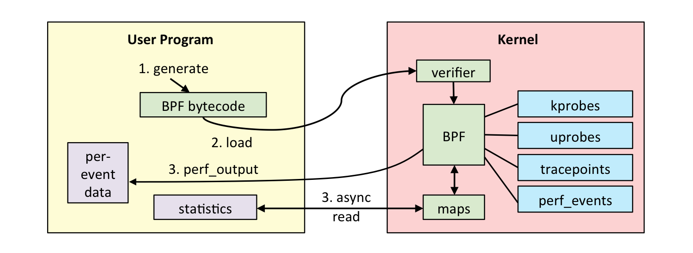
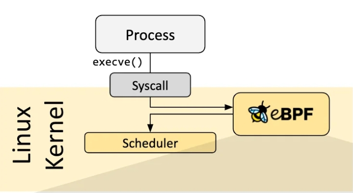
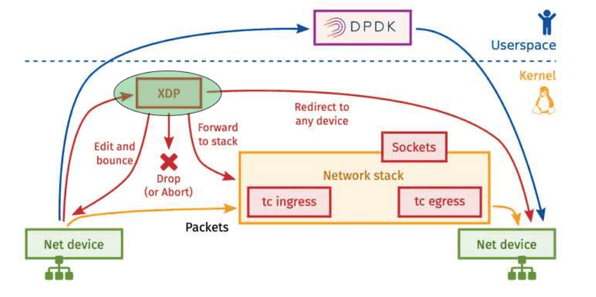
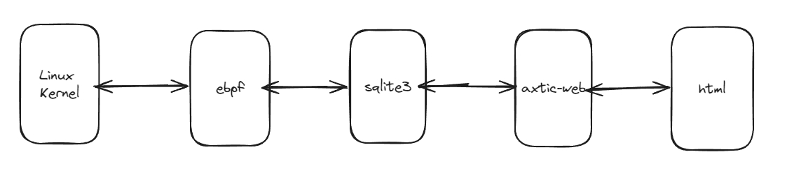
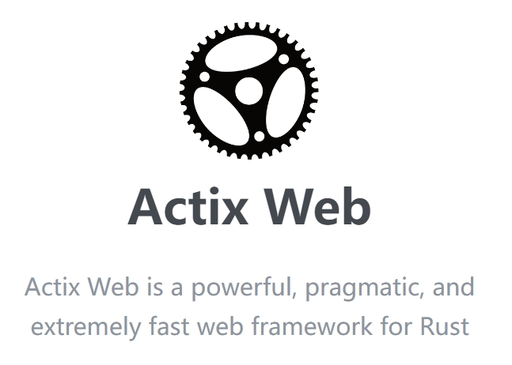
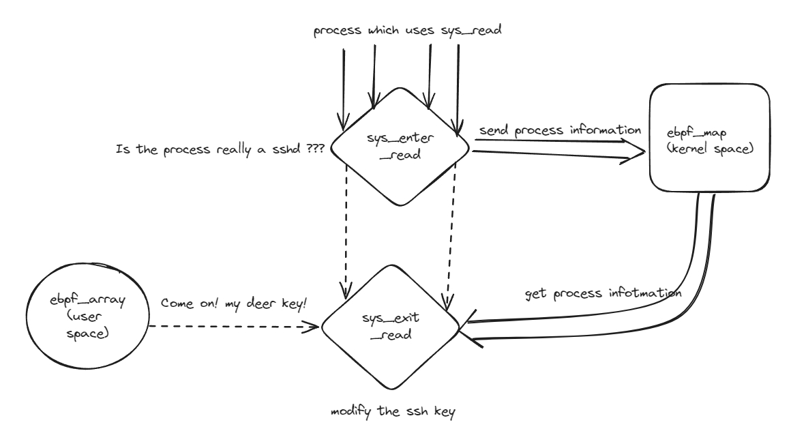

## What 's the ebpf?

- 伯克利包过滤器（Berkeley Packet Filter）最初是一个 Linux kernel 中用以对来自于链路层的数据包进行过滤的架构。
- eBPF 使用内核虚拟机技术，将 eBPF 指令翻译为 eBPF 虚拟机的字节码，可以高效地工作在 Linux kernel 内部的 RISC架构的 虚拟机上。
- eBPF 是一项革命性的技术，起源于 Linux 内核，它可以在特权上下文中（如操作系统内核）运行沙盒程序。它用于安全有效地扩展内核的功能，而无需通过更改内核源代码或加载内核模块的方式来实现。

## {}


## Verifier && Map

- ebpf map 是一个通用的用以储存不同种类数据的结构，用以在用户进程与 eBPF 程序、eBPF 程序与 eBPF 程序之间进行数据共享。

- 在 eBPF 字节码被传入到内核空间后，其首先需要经过 verifier 的安全检查，之后才能进行 JIT 编译。

{fig-align="center" width="75%" height="75%"}

## {}

- 由于ebpf在内核中运行，为了尽最大可能防止ebpf对内核稳定性的影响，增强鲁棒性。
- 另一方面，由于内核代码编写debug相对比较困难，所以使用校验器对编写好的 ebpf 代码进行预检查，verifier 会模拟 ebpf 程序运行，将潜在的错误抛出，阻止编译，提高 ebpf 程序的稳定性和开发效率。

## Hook Overview

- eBPF 程序是事件驱动的，当内核或应用程序通过某个钩子点时运行。预定义的钩子包括系统调用、函数入口/退出、内核跟踪点、网络事件等。

{fig-align="center"}

## ebpf XDP

- Linux XDP（eXpress Data Path）是一种高性能的数据包处理技术，它在 Linux 内核中引入新数据包处理路径。XDP 允许用户空间程序在数据包到达网络设备驱动程序之前拦截和处理数据包，从而实现低延迟、高吞吐量的数据包处理。

## {}

{fig-align="center"}

## Rust && Aya

- Aya 是完全基于 libc 之上开发的“纯” Rust 框架，可以做到Rust 全过程开发，并充分利用 Rust 的先进的开发理念，在编译阶段清除所有可能的错误，配合 verifier，实现双重安全保护，降低发生潜在错误的概率，提高开发效率，减少 debug 时间。

{fig-align="center" width="50%" height="50%"}

- Double Secure, Double Peace

## Rust

- Rust 通过在强制使用智能指针监视堆空间内存的使用与释放，强制使用所有权机制全过程监视变量的生命周期，在制度上彻底(?)杜绝悬垂指针和内存泄漏等内存安全问题。

{fig-align="center"}

## XDP 防火墙构建思路

- 目标：使用ebpf XDP项目实现一个轻量级的，可扩展性高的防火墙

{fig-align="center"}

## {}

{fig-align="center"}

- 为了联系 ebpf 程序和前端界面，实现 **前后端分离**

- 以后端服务为抽象层，实现简化

- 为了联系 ebpf 与后端服务器, 以**数据驱动**为指导，实现ebpf程序通过 sqlite3 数据库与后端服务器进行通信

## 多线程

- 新时代异步

{fig-align="center" width="30%" height="30%"}
{fig-align="center" width="30%" height="30%"}
{fig-align="center" width="30%" height="30%"}

## ping 不了



## 捕获 ⚓ 封锁 ⚓ 解禁



## 玩具级 ebpf Rootkit

- ebpf Tracepoint
- 实现免密码登录目标主机
- 通过 hook sys_read_enter 和 sys_read_exit 并配合 ebpf，实现一个基本的 Rootkit 功能。

## {}

{fig-align="center"}

## unsafe code

```{.rust code-line-numbers="2-4"}
    unsafe {
        let buff_addr: u64 = ctx.read_at(24).unwrap();

        let size: u64 = ctx.read_at(32).unwrap();

        data.buffer_addr = buff_addr;

        data.calling_size = size;
    }
```

## 参数哪里来

```shell
# cat /sys/kernel/debug/tracing/events/syscalls/sys_enter_read/format
name: sys_enter_read
ID: 680
format:
        field:unsigned short common_type;       offset:0;       size:2; signed:0;
        field:unsigned char common_flags;       offset:2;       size:1; signed:0;
        field:unsigned char common_preempt_count;       offset:3;       size:1; signed:0;
        field:int common_pid;   offset:4;       size:4; signed:1;

        field:int __syscall_nr; offset:8;       size:4; signed:1;
        field:unsigned int fd;  offset:16;      size:8; signed:0;
        field:char * buf;       offset:24;      size:8; signed:0;
        field:size_t count;     offset:32;      size:8; signed:0;

print fmt: "fd: 0x%08lx, buf: 0x%08lx, count: 0x%08lx", ((unsigned long)(REC->fd)), ((unsigned long)(REC->buf)), ((unsigned long)(REC->count))
```

## {}



## {}

- 感谢

{fig-align="center"}
